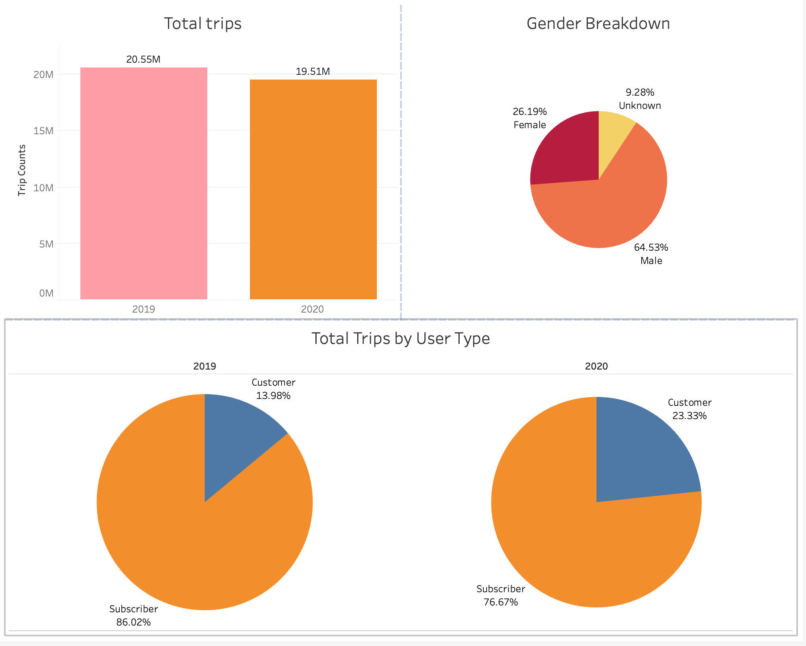
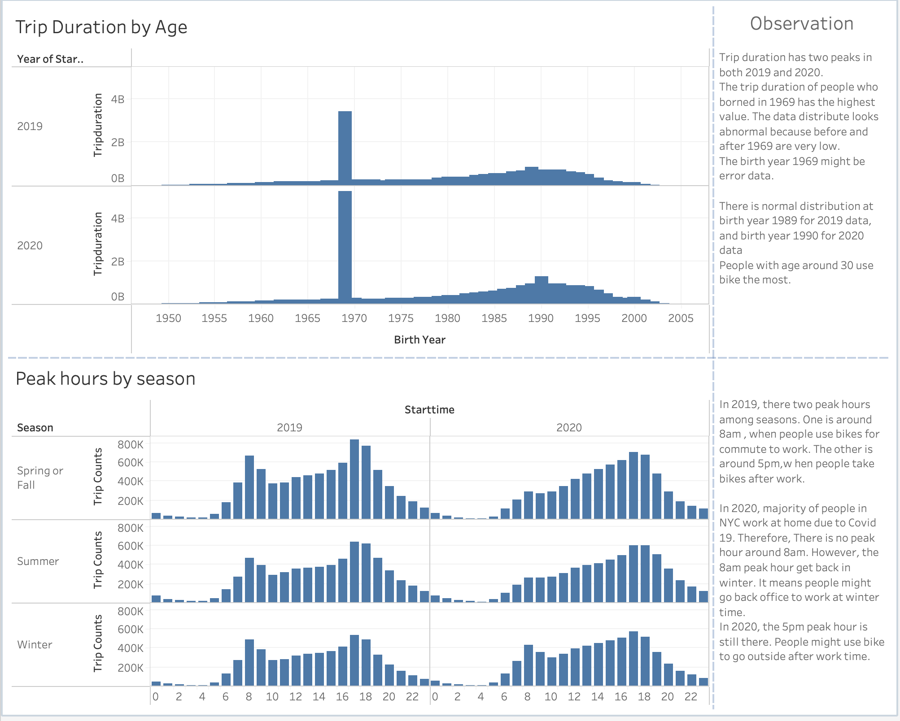
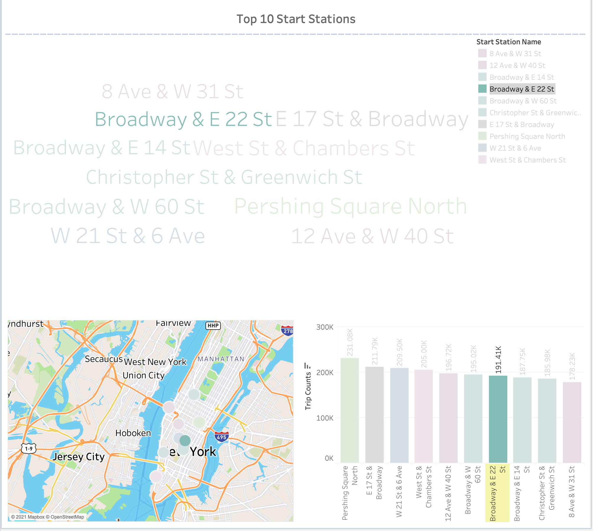
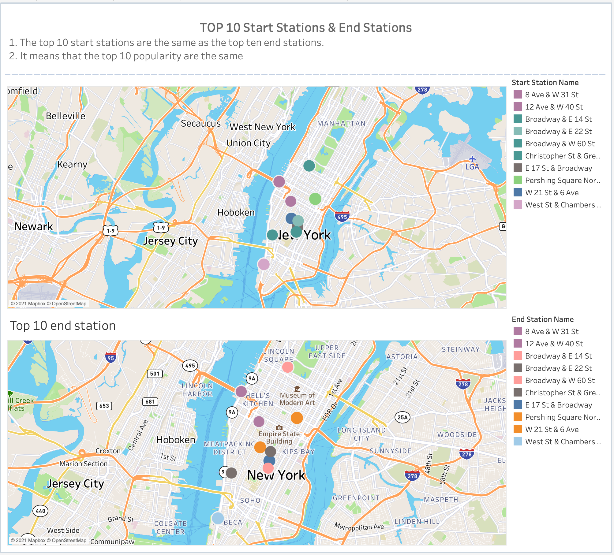
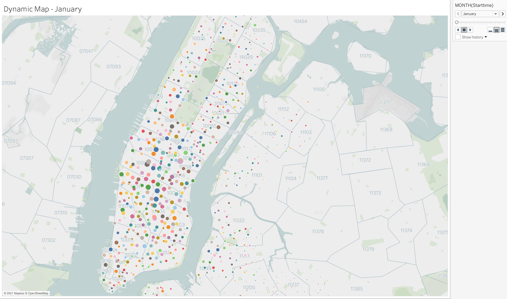

# Tableau Workbook

- Download link: https://demo-virginia-simon.s3.amazonaws.com/Citi-Bike-Analytics-Workbook.twbx

# Tableau Online

https://10ay.online.tableau.com/#/site/simonxulan/views/Citi-Bike-Analytics-Workbook/Story1?:iid=2

# Total trips breakdown

# Trip Duration by Age and Peak Hours

# Top 10 Start Stations

# Top 10 Start and End Stations

# Dynamic Map Snap Shot

